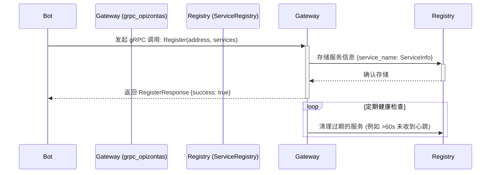
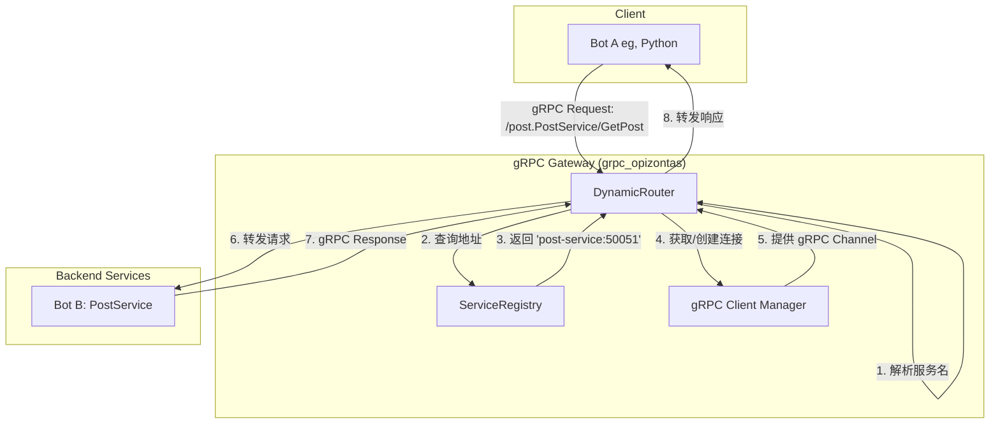

# 项目架构设计

本文档描述了 `grpc_opizontas` 项目的整体代码架构和模块职责。

## 1. 目录结构

```
grpc_opizontas/
├── Cargo.toml
├── build.rs              # 构建脚本，用于编译 .proto 文件
├── proto/
│   └── registry.proto    # 服务注册 API 定义
└── src/
    ├── main.rs           # 应用入口，初始化和启动服务器
    ├── server.rs         # gRPC 服务器的配置和启动逻辑
    └── services/
        ├── mod.rs        # 声明服务模块
        ├── client_manager.rs # 管理到后端服务的 gRPC 客户端连接
        ├── registry_service.rs # 实现服务注册逻辑
        └── router_service.rs # 实现动态请求路由
```

## 2. 模块职责

*   **`main.rs`**: 程序的唯一入口。负责调用 `server` 模块来启动 gRPC 网关服务。
*   **`server.rs`**: 核心服务器模块。负责初始化 `tonic` 服务，将 `RegistryService` 添加到服务器，并配置动态路由。
*   **`services/`**: 网关的核心功能实现。
    *   **`registry_service.rs`**: 实现了 `RegistryService` gRPC 服务。它允许后端服务（Bots）注册其地址和所提供的服务。它还包含一个后台任务，用于定期清理无响应的过期服务。
    *   **`router_service.rs`**: 实现了一个动态的 `tower::Service`。它拦截所有传入的 gRPC 请求，从请求路径中解析出服务名称，然后在服务注册表中查找该服务的健康实例地址，并将请求转发过去。
    *   **`client_manager.rs`**: 负责创建和缓存到后端 gRPC 服务的客户端连接 (`tonic::transport::Channel`)。这避免了为每个请求重复创建连接的开销，提高了性能。
*   **`proto/registry.proto`**: 定义了 `RegistryService` 的 gRPC 接口，包括 `Register` 方法及其请求和响应消息。
## 3. 数据流与服务发现

`grpc_opizontas` 的核心是一个动态的 gRPC 网关，它结合了服务注册和请求路由。

### 3.1. 服务注册流程

下图展示了后端服务（Bots）如何向网关注册自己：



**注册流程说明:**

1.  **启动**: 当一个后端 Bot（例如，`PostService` 的实现）启动时，它会向 `grpc_opizontas` 网关发起一个 `Register` gRPC 调用。
2.  **注册信息**: 请求中包含了 Bot 的网络地址（如 `http://post-service:50051`）和它所提供的服务名称列表（如 `["PostService", "CommentService"]`）。
3.  **存入注册表**: 网关的 `RegistryService` 接收到请求，并将服务信息（地址、健康状态、最后心跳时间）存储在内存中的 `ServiceRegistry` (一个 `HashMap`) 中。
4.  **后台清理**: 网关内部有一个定时任务，会定期检查注册表，移除那些长时间没有心跳的“不健康”或“过期”的服务，确保路由的可靠性。

### 3.2. 动态请求路由流程

当一个客户端（例如另一个 Bot）通过网关请求服务时，数据流如下：



**路由流程说明:**

1.  **接收请求**: **Bot A** (客户端) 向网关发送一个 gRPC 请求，例如调用 `post.PostService` 的 `GetPost` 方法。
2.  **解析服务**: 网关的 **DynamicRouter** 拦截该请求，并从 gRPC 路径 (`/post.PostService/GetPost`) 中解析出服务名称 `PostService`。
3.  **查询注册表**: **DynamicRouter** 查询 **ServiceRegistry**，寻找名为 `PostService` 的健康服务实例的地址。
4.  **获取连接**: 注册表返回 `PostService` 的地址（例如 `http://post-service:50051`）。**DynamicRouter** 随后请求 **ClientManager** 提供一个到该地址的 gRPC 客户端连接。**ClientManager** 会复用现有连接或按需创建新连接。
5.  **转发请求**: **DynamicRouter** 使用获取到的客户端连接，将原始的 `GetPost` 请求转发到 **PostService** (Bot B)。
6.  **返回响应**: **PostService** 处理请求并返回响应。**DynamicRouter** 接收到响应后，再将其原路返回给 **Bot A**。

通过这种方式，`grpc_opizontas` 实现了服务解耦和动态路由，客户端无需知道后端服务的具体地址，所有服务都可以动态地加入或离开系统。