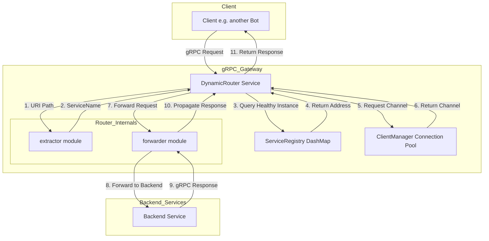

# 项目架构设计

本文档描述了 `grpc_opizontas` 项目的整体代码架构和模块职责。

## 1. 目录结构

```
grpc_opizontas/
├── Cargo.toml
├── build.rs              # 构建脚本，用于编译 .proto 文件
├── config.toml           # 默认配置文件
├── proto/
│   └── registry.proto    # 服务注册 API 定义
├── doc/
│   └── proto/            # 包含后端服务 .proto 文件的示例
│       ├── post.proto
│       └── recommendation.proto
└── src/
    ├── main.rs           # 应用入口，初始化日志和启动服务器
    ├── server.rs         # gRPC 服务器的配置和启动逻辑
    ├── config.rs         # 配置加载与管理模块
    └── services/
        ├── mod.rs        # 声明和导出服务模块
        ├── client_manager.rs # 高性能 gRPC 客户端连接池
        ├── registry_service.rs # 实现服务注册与健康检查逻辑
        └── router/         # 动态请求路由模块
            ├── mod.rs
            ├── error.rs
            ├── extractor.rs
            ├── forwarder.rs
            └── response.rs
```

## 2. 模块职责

*   **`main.rs`**: 程序的唯一入口。负责初始化 `tracing` 日志系统，并调用 `server` 模块来启动 gRPC 网关服务。
*   **`server.rs`**: 核心服务器模块。负责加载配置，初始化并同时注册 `DynamicRouter` 和 `RegistryService`。它将 `DynamicRouter` 作为处理所有未知请求的核心 `tower::Service`，同时显式添加 `RegistryService` 以便处理服务注册的特定请求。
*   **`config.rs`**: 负责从 `config.toml` 文件和环境变量中加载配置。它提供了强类型的配置结构体（如 `SecurityConfig`, `RouterConfig`），并支持环境变量覆盖默认值，为整个应用提供统一的配置访问接口。
*   **`services/`**: 网关的核心功能实现。
    *   **`registry_service.rs`**: 实现了 `RegistryService` gRPC 服务。它使用 `dashmap` 提供线程安全的服务注册表，允许后端服务（Bots）通过 `api_key` 进行安全认证后，注册其地址和所提供的服务。它还管理服务的健康状态（`ServiceHealthStatus`），并包含一个后台任务，用于定期清理心跳超时的过期服务。
    *   **`router/`**: 一个模块化的动态路由层，实现了 `tower::Service` trait。
        *   `mod.rs`: 路由器的核心，负责接收请求，调用 `extractor` 解析服务名，查询注册表获取健康的服务实例，并委托 `forwarder` 进行请求转发。
        *   `extractor.rs`: 负责从传入请求的 URI 路径中解析出 gRPC 的服务名称。
        *   `forwarder.rs`: 负责将请求高效地转发到后端服务。它使用 `client_manager` 获取连接，并管理请求的超时逻辑。
        *   `error.rs` & `response.rs`: 提供统一的错误类型定义和 gRPC 错误响应的构建逻辑。
    *   **`client_manager.rs`**: 实现了一个功能完备的 gRPC 客户端连接池。它负责按需创建、缓存、复用和清理到后端服务的 `tonic::transport::Channel`。该模块包含了连接生命周期管理（TTL、空闲超时）和淘汰策略，以显著提高性能和资源利用率。
*   **`proto/registry.proto`**: 定义了 `RegistryService` 的 gRPC 接口。关键的 `RegisterRequest` 消息中包含了 `api_key` 字段，用于保障注册过程的安全性。
## 3. 数据流与服务发现

`grpc_opizontas` 的核心是一个结合了安全服务注册和高性能动态路由的 gRPC 网关。

### 3.1. 服务注册流程

下图展示了后端服务（Bot）如何安全地向网关注册，以及网关如何维护服务健康状态：

```mermaid
sequenceDiagram
    participant Bot as Backend Bot
    participant Gateway as grpc_opizontas Gateway
    participant Registry as ServiceRegistry (DashMap)
    participant CleanupTask as Background Task

    Bot->>+Gateway: gRPC Call: Register(api_key, address, services)
    Gateway->>Gateway: 1. Validate api_key from config
    alt Invalid Token
        Gateway-->>-Bot: Return Unauthenticated Error
    else Valid Token
        Gateway->>+Registry: 2. Upsert service info {address, last_heartbeat, health_status: Healthy}
        Registry-->>-Gateway: Confirm storage
        Gateway-->>-Bot: Return RegisterResponse {success: true}
    end

    par
        loop Periodic Cleanup
            CleanupTask->>CleanupTask: Sleep for heartbeat_timeout
            CleanupTask->>Registry: 3. Scan for expired services (last_heartbeat > timeout)
            Registry->>Registry: Remove expired entries
        end
    end
```

**注册流程说明:**

1.  **发起注册**: 后端 Bot 启动时，向网关发起 `Register` gRPC 调用。请求中必须包含一个有效的 **`api_key`**，以及自身的网络地址和服务列表。
2.  **安全验证**: 网关的 `RegistryService` 首先会使用 `config.rs` 提供的配置来验证 `api_key` 的有效性。如果无效，则拒绝请求。
3.  **存入注册表**: 验证通过后，服务信息（地址、当前时间作为最后心跳、健康状态设为 `Healthy`）将被存入一个并发安全的 `dashmap` 中。
4.  **后台清理**: `RegistryService` 内部会启动一个独立的 `tokio` 后台任务。该任务会根据配置的 `heartbeat_timeout` 定期运行，扫描注册表并移除所有心跳过期的服务，从而确保路由的可靠性。

### 3.2. 动态请求路由流程

当客户端通过网关请求服务时，`DynamicRouter` 会执行以下流程：



**路由流程说明:**

1.  **接收请求**: 客户端向网关发送 gRPC 请求，例如调用 `post.PostService` 的 `GetPost` 方法。
2.  **解析服务**: 网关的 `DynamicRouter` 接收请求。其内部的 `extractor` 模块从 gRPC 路径 (`/post.PostService/GetPost`) 中解析出服务名 `PostService`。
3.  **查询健康实例**: `DynamicRouter` 查询 `ServiceRegistry`，寻找服务名为 `PostService` 且健康状态为 `Healthy` 的实例地址。
4.  **获取连接**: 查找到地址后，`DynamicRouter` 向 `GrpcClientManager` (连接池) 请求一个到该地址的客户端连接 (`Channel`)。
5.  **连接复用**: `ClientManager` 会检查是否存在到该地址的可用连接。如果存在，则立即返回该连接；如果不存在，则创建一个新连接，存入池中，然后返回。这极大地减少了连接建立的开销。
6.  **转发请求**: `DynamicRouter` 的 `forwarder` 模块使用获取到的 `Channel`，将原始请求（包含超时控制）转发到后端的 `PostService`。
7.  **返回响应**: `PostService` 的响应经由 `forwarder` 和 `DynamicRouter`，最终被返回给原始客户端。

通过这种方式，`grpc_opizontas` 实现了安全、解耦且高性能的动态路由，客户端无需知道后端服务的具体地址，所有服务都可以动态地加入或离开系统。

## 4. 配置与安全

### 4.1. 配置加载

项目的配置由 `src/config.rs` 模块统一管理，遵循一个分层的加载策略：

1.  **默认值**: 在 `Config::default()` 中为所有配置项提供了合理的默认值。
2.  **文件加载**: 程序启动时会尝试读取项目根目录下的 `config.toml` 文件。如果文件存在，其内容将覆盖默认值。
3.  **环境变量覆盖**: 最后，程序会检查特定格式的环境变量（例如 `GRPC_SECURITY_TOKENS`, `GRPC_ROUTER_REQUEST_TIMEOUT`）。如果设置了这些环境变量，它们将覆盖之前从文件或默认值中加载的配置。

这种分层策略提供了高度的灵活性，允许在不同环境（开发、测试、生产）中使用不同的配置，而无需修改代码。

### 4.2. 安全认证

为了保护服务注册接口不被滥用，网关实现了一个基于 Token 的简单安全机制。

*   **配置**: 可接受的 Token（`api_key`）列表在配置的 `security.tokens` 字段中定义。推荐通过环境变量 `GRPC_SECURITY_TOKENS` 来设置，多个 Token 之间用逗号分隔。
*   **验证**: 当后端 Bot 调用 `RegistryService` 的 `Register` 方法时，必须在 `RegisterRequest` 中提供一个有效的 `api_key`。
*   **执行**: `MyRegistryService` 在处理注册请求时，会调用 `config.validate_token()` 方法来检查请求中的 `api_key` 是否存在于配置的 Token 列表中。如果验证失败，将返回 `Unauthenticated` 错误，拒绝本次注册。

这个机制确保了只有受信任的后端服务才能向网关注册自己。