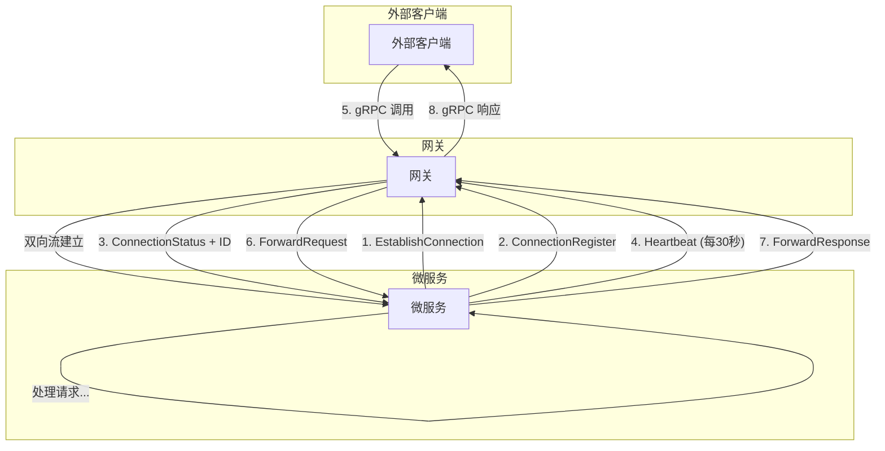

# 如何连接到 Grpc 网关

本文档将指导您如何作为 **服务提供端** 将您的服务接入网关。项目在设计之初就是为了帮助微服务跨网络数据调度。

## 基本逻辑

首先，我们要知道作为基础的服务，你需要加载什么内容给 网关，让我们一起看看注册的消息的proto 定义文件。

```protobuf
message RegisterRequest {
  // API 密钥，用于身份验证
  string api_key = 1;
  // Bot 的网络地址, 例如 "http://bot-a:50051"
  string address = 2;
  // Bot 提供的 gRPC 服务名称列表
  repeated string services = 3;
}

message RegisterResponse {
  // 注册是否成功
  bool success = 1;
  // 可选的返回消息
  string message = 2;
}

// 反向连接消息类型
message ConnectionMessage {
  oneof message_type {
    // 微服务连接注册
    ConnectionRegister register = 1;
    // 网关推送的请求
    ForwardRequest request = 2;
    // 微服务返回的响应
    ForwardResponse response = 3;
    // 心跳消息
    Heartbeat heartbeat = 4;
    // 连接状态消息
    ConnectionStatus status = 5;
    // 事件消息
    EventMessage event = 6;
    // 订阅请求消息
    SubscriptionRequest subscription = 7;
  }
}

// 连接注册消息
message ConnectionRegister {
  // API 密钥，用于身份验证
  string api_key = 1;
  // 微服务提供的 gRPC 服务名称列表
  repeated string services = 2;
  // 连接标识符
  string connection_id = 3;
}
```

我们要明白，链接到网关的关键是 地址 和 token。在注册的时候，你需要链接到**网关地址**，然后将 Token 作为注册消息的有效荷载发送到网关。**不是 HTTP header！！！！！！**

## 连接方式：反向连接模型

与传统的客户端-服务器模型不同，本网关采用 **反向连接** 模型。这意味着：

- **您的微服务作为客户端**，主动连接到网关
- **建立长期的双向 gRPC 流**，用于所有后续通信
- **网关通过这个流推送请求**给您的服务
- **您的服务通过同一个流返回响应**

### 为什么使用反向连接？

- ✅ **穿透防火墙**：微服务可以在内网环境中运行，无需暴露端口
- ✅ **简化网络配置**：不需要复杂的负载均衡和服务发现
- ✅ **实时通信**：双向流支持实时的请求-响应模式
- ✅ **统一管理**：网关集中管理所有服务连接

## 连接流程详解

### 第一步：建立连接

您的服务需要调用网关的 `RegistryService.EstablishConnection` 方法，这会创建一个双向流：

```
您的服务 ---[EstablishConnection]---> 网关
           <---[双向流建立]---
```

### 第二步：发送注册消息

连接建立后，**立即**发送 `ConnectionRegister` 消息：

```protobuf
ConnectionMessage {
  register: ConnectionRegister {
    api_key: "your-api-key-here",
    services: ["post.PostService", "user.UserService"],
    connection_id: ""  // 留空，网关会分配
  }
}
```

其中，我们需要注意这些重要字段：

- `api_key`: 您的身份验证密钥（从网关管理员获取）
- `services`: 您要注册的 gRPC 服务完整名称列表（格式：`package.ServiceName`）
- `connection_id`: 首次连接时留空

### 第三步：接收连接 ID

网关验证成功后，会返回 `ConnectionStatus` 消息：

```protobuf
ConnectionMessage {
  status: ConnectionStatus {
    connection_id: "uuid-generated-by-gateway",
    status: CONNECTED,
    message: "Successfully registered"
  }
}
```

请注意：！！！！！！**⚠️ 关键：保存这个 `connection_id`！**这个 ID 是您后续所有通信的唯一标识符，特别是发送心跳时必须使用。

### 第四步：启动心跳机制

为了保持连接活跃，您必须定期发送心跳消息（建议每 30 秒）：

```protobuf
ConnectionMessage {
  heartbeat: Heartbeat {
    timestamp: 1699999999,  // Unix 时间戳
    connection_id: "uuid-from-step-3"  // 使用网关分配的 ID
  }
}
```

这里有一些常见错误：

- ❌ 使用服务名称作为 connection_id
- ❌ 使用自己生成的 ID
- ✅ 必须使用网关返回的 connection_id

### 第五步：处理转发请求

当外部客户端调用您的服务时，网关会发送 `ForwardRequest`：

```protobuf
ConnectionMessage {
  request: ForwardRequest {
    request_id: "unique-request-id",
    method_path: "/post.PostService/GetPost",
    headers: {"content-type": "application/grpc"},
    payload: <protobuf-encoded-bytes>,
    timeout_seconds: 30
  }
}
```

然后需要注意：

- `request_id`: 请求的唯一标识符，响应时必须原样返回
- `method_path`: gRPC 方法的完整路径
- `payload`: 原始请求的 protobuf 编码字节
- `timeout_seconds`: 请求超时时间

### 第六步：返回响应

处理完请求后，发送 `ForwardResponse`：

```protobuf
ConnectionMessage {
  response: ForwardResponse {
    request_id: "same-as-request",  // 必须与请求 ID 匹配
    status_code: 0,  // gRPC 状态码（0 = OK）
    payload: <protobuf-encoded-response>,
    error_message: ""  // 如果有错误，填写错误信息
  }
}
```

## 完整的消息流程图




### 1. 请求处理逻辑

收到 `ForwardRequest` 后的处理步骤：

1. **解析方法路径**：从 `method_path` 中提取服务和方法名
2. **反序列化请求**：将 `payload` 字节反序列化为对应的 protobuf 消息
3. **调用本地服务**：调用您实际的服务实现
4. **序列化响应**：将响应消息序列化为字节
5. **发送响应**：构造 `ForwardResponse` 并发送

### 2. 超时处理

注意 `ForwardRequest.timeout_seconds` 字段，确保您的处理时间不超过这个限制。建议：

- 使用 context 或 timeout 机制
- 如果超时，返回适当的错误响应
- 不要让请求无限期挂起

## 事件发布/订阅（可选）

网关还支持事件总线功能，允许服务之间通过事件通信。

### 订阅事件

```protobuf
ConnectionMessage {
  subscription: SubscriptionRequest {
    action: SUBSCRIBE,
    event_types: ["user.login", "order.created"],
    subscriber_id: "your-connection-id"
  }
}
```

### 发布事件

```protobuf
ConnectionMessage {
  event: EventMessage {
    event_id: "unique-event-id",
    event_type: "user.login",
    publisher_id: "your-connection-id",
    payload: <event-data-bytes>,
    timestamp: 1699999999,
    metadata: {"user_id": "123"}
  }
}
```

就是这样，我摸鱼去了
